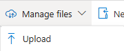

Links to deploy custom template for lighthouse authorizations:

## 1. Complete Azure Lighthouse authorizations using this ARM template.

  <a href="https://portal.azure.com/#create/Microsoft.Template/uri/https%3A%2F%2Fraw.githubusercontent.com%2Fjpanderson91%2Flighthouse%2Frefs%2Fheads%2Fmain%2Flighthouseauthorizations.json/createUIDefinitionUri/https%3A%2F%2Fraw.githubusercontent.com%2Fjpanderson91%2Flighthouse%2Frefs%2Fheads%2Fmain%2Flighthouseauthorizationsui.json" target="_blank">

## 2. Download and run UMI creation PowerShell script in Azure Cloud Shell

  - Download [UMI Deployment script](New-UmiDeployment.ps1) (Right-click and click *Save link as*).
  - In the Azure Portal, open Cloud Shell.
    - Select PowerShell as the shell type.
    - Select **No storage account required.**
    - Select your Sentinel subscription.
    - Click **Apply**.

  

  - Upload the file to the Cloud Shell using the **Manage Files > Upload** button in the Cloud Shell toolbar.

  

  - Run the script with the command `./New-UmiDeployment.ps1`.
  - Follow the prompts to complete the deployment.
  - You may need to grant your account access to use the Microsoft Graph API.

## 3. Azure Automation

The automation account is deployed by the MSSP.

## 4. Deploy Sentinel using template

If you would like the standard connectors to be connected, the customer must be signed in with Global Admin. Otherwise the SOC can complete the basic deployment and the work with the customer to complete the configuration steps.

### SUPER BASIC Sentinel

### Customized Sentinel-All-In-One v2

